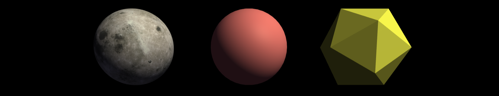

# webgl.js
Javascript drawing in 3D 

Deployed at: https://brettonw.github.io/webgl.js/ or http://webgl-js.azurewebsites.net/.

### Building
This project uses ant for building, with the "dev" target being the default:
 
    ant | ant dev | ant rel

### Build Dependencies
* ant
* node/npm
* gcc (for the C-preprocessor)
* uglify-js (for Minification)
* yuidoc (for Documentation)

### UglifyJS
Uglify-JS provides minification and some obscuration, and is installed via npm:

    npm install --location=global uglify-js

### YUIDoc
YUIDoc is the documentation processor of choice as it only reads the comments and doesn't impose any code structure. Installation is via npm:
 
    npm install --location=global yuidocjs
    
See the [Syntax reference](http://yui.github.io/yuidoc/) for explanation of documentation requirements.

The display theme is [lucid](https://www.npmjs.com/package/yuidoc-lucid-theme), installed as:

    npm install --location=global yuidoc-lucid-theme
    
### Building a scene
...
